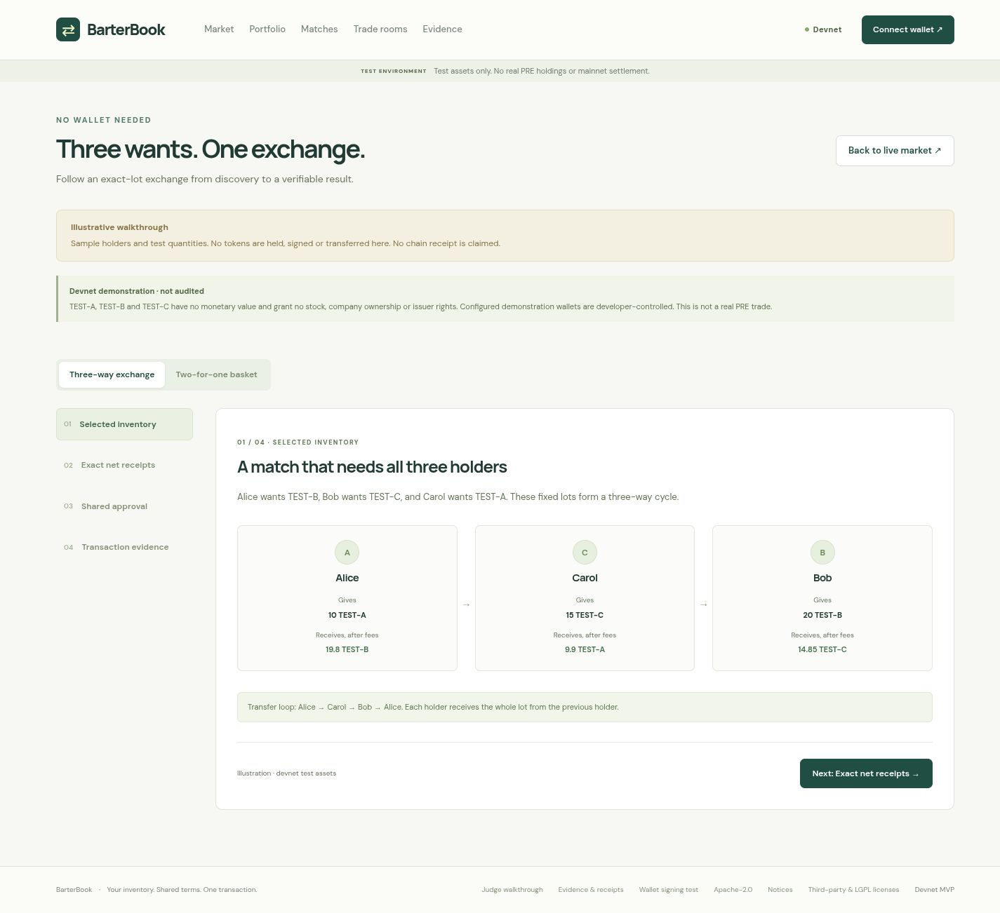

# BarterBook

**Current work — longer-lived signing:** The owner’s version 8 test saved Bob’s signature, then Alice’s verified signature arrived after the chain’s roughly 25-second signing lifetime. [Measured timing](evidence/hosted/browser-v8-signing-expiry.json) identifies expiry as this retry’s failure. The owner requested [longer-lived signing](docs/durable-signing.md), including wallet-controlled setup, on-chain cancellation and recovery. [Updated two-person and three-person steps](docs/browser-transaction-retest.md). Deployment status is recorded below after verification.

**Earlier diagnostic deployment — September 25:** The owner reports another rejection in refreshed room version 7 and a later Solflare network warning. [Both configured providers confirmed Devnet origin and later blockhash expiry](evidence/hosted/solflare-v7-signing-diagnostic.json); the exact frozen message verifies in isolated Firefox. The [follow-up update is deployed as build `a91581c`](evidence/hosted/signing-check-deployment-a91581c.json), with [272 passing CI tests](evidence/local/ci-36169861192.json). It adds a Devnet/lifetime check before wallet prompts and **Check transaction without signing** in the room. Bob’s actual browser report now confirms exact message agreement and the intended Solflare/account connection. [Safely reconcile version 7, then retry the two-person rehearsal with fresh consent](docs/browser-transaction-retest.md#current-next-step-longer-lived-signing). The original rejection’s cause and real extension settlement remain unverified.

**Earlier deployment — September 25, 17:24 UTC:** The [Solflare transaction-message signing repair](docs/solflare-transaction-signing.md) is live as build `b45551b`, Worker `dd5624c1-15b3-4115-a30b-06cd53c31aba`. [Served-file verification](evidence/hosted/solflare-signing-deployment-b45551b.json) passed; [CI passed all 262 tests](evidence/local/ci-36166658227.json). The owner explicitly approved publication and deployment. Follow the [two-person retry and three-person rehearsal steps](docs/browser-transaction-retest.md). Actual extension settlement remains to be verified. At deployment, version 6 had no saved signatures or transaction ID and still needed reconciliation. The older network-warning investigation below is historical.

BarterBook combines a selected-inventory offer board, exact two-owner token baskets, and bounded three-owner exact-lot matching. Participants authorize one atomic Solana transaction using existing token programs. The application has no onchain program, custody wallet, trading key, pool, or standing token delegation.

**Live Devnet-configured prototype:** [open the no-wallet guide](https://barterbook-devnet.rileycreighton.workers.dev/#/walkthrough), [source](https://github.com/RileyCreighton/barterbook), [CI for deployed build `a91581c`](https://github.com/RileyCreighton/barterbook/actions/runs/36169861192).

The hosted website, API and D1 authentication/persistence checks pass. Cloudflare access is restored; the deployed app has three validated mock mints, six demo participants and the SDK proof view. All three browser participants' authentication records were independently found in D1; the user earlier reported Phantom logins and portfolios showing 1,000 of each mock token, and now reports Solflare logins for all three original wallets in Zen. **Settlement is enabled for the authorized devnet rehearsal**, but browser settlement is unproven and measured financial-path CPU exceeds the Workers Free allowance. Alice created the correct 10 TEST-A + 5 TEST-B / 20 TEST-C offer with Bob as fee payer; [the earlier D1 snapshot confirmed both accepted version 1 and were ready](evidence/hosted/browser-readiness-1790324985916.json). Their stopped browser attempt `026ed6d7-5368-455e-a1b2-c0963cdeeab7` safely reconciled to `EXPIRED_UNLANDED`, `safeToRetry: true`, after complete history checks from both trusted providers. The user reported no wallet popup; no signatures or transaction identifier were stored. [Latest terms version 5](evidence/hosted/solflare-network-diagnostic-256c575e.json) reached Bob’s Solflare 2.28.1 network-mismatch prompt, with no signature stored, then independently reconciled as expired and unlanded. Both RPCs verify the frozen blockhash originated on Devnet; the warning’s cause and a secure workaround remain unproven. No browser exchange or Chrome test is claimed. Developer-run SDK tests finalized a real devnet basket and three-owner exchange both directly and through the hosted API; an earlier controlled failure had zero token settlement. [Their receipts](evidence/devnet/20260925-sdk-proof-01/) are distinct from browser settlement and local LiteSVM evidence. Mock assets never represent PRE holdings; mainnet is disabled.

**Earlier deployment — September 25, 10:03 UTC:** [signing-feedback UI `9356ad6aa5fc50d5d78840655815687fb9add5a4`](evidence/hosted/signing-feedback-deployment-9356ad6.json), Worker `f041aa3d-8363-4656-92b3-3f77ff8a2e8f`, is live. The served bundle hash matches the tested build, health reports Devnet, and both earlier SDK receipts remain in public history. This changes signing feedback only; financial checks and transaction bytes are unchanged. The 42 focused wallet/signing/session tests, typecheck and build passed; [CI for `9356ad6` passed all 242 tests](evidence/local/ci-36121726045.json), with zero failures or pending tests. Solflare transaction compatibility remains blocked and the Free CPU gate remains unmet. The next action is review of the [prepared Solflare diagnostic report](docs/solflare-network-report.md), which has **not been sent**; no Mainnet switch or blind retry is requested.

**Earlier recovery deployment — September 25, 09:13 UTC:** [recovery repair `63378c6`](evidence/hosted/recovery-deployment-63378c6.json), Worker `82b42cd9-aa9c-4111-96e7-666060f13c2d`, was deployed with both explicit address-history trust flags enabled after assessment. The 58 local recovery/settlement tests, typecheck and build passed; [this commit’s CI passed 242/242 tests, with zero failures or pending tests](evidence/local/ci-36117159889.json). The [original browser attempt safely reconciled](evidence/hosted/browser-original-reconciled-026ed6d7.json) to `EXPIRED_UNLANDED`, `safeToRetry: true`, with its journal and null transaction identifier preserved. The later version 5 Solflare attempt also safely reconciled with no stored signature after a reported Devnet/Mainnet mismatch warning. Full browser transaction compatibility remains blocked; the independently verified Devnet blockhash does not establish the extension warning’s cause. [Latest hosted CPU](evidence/hosted/cpu-2026-09-25T09-51-25.797Z.json) contains 144 rows: prepare 48 ms, renewal 28 ms and fresh assets 4–5 ms, with no signature POST in the window. All outcomes were `ok`, but the Free budget remains unmet; earlier recovery used 60 ms. This deployment does not establish browser signing or a Free CPU budget pass.

**Earlier hosted SDK milestone — September 25, 08:43–08:44 UTC:** commit `837b06c735b8fad6ac6302031a6469be84be28ef`, Worker `f3221118-0847-45f2-9c36-e2799cba82b7`. Alchemy passed [11 read-only checks](evidence/devnet/20260925-sdk-proof-01/recovery-provider-checks/alchemy-1790325426672-5f5fe58c-7548-4e4b-8ad3-ef0ec142d7a1.json) and is configured as the server-only backup. At 08:38, [original-attempt reconciliation](evidence/devnet/20260925-sdk-proof-01/hosted-original-reconciliation-1790325517997.json) reached `EXPIRED_UNLANDED`, `safeToRetry: true`, with both providers healthy and trusted; the original journal remains preserved.

A new SDK batch, `hosted-financial-02`, using the normal hosted API and `hosted-judge-02` seed, finalized the [basket](evidence/devnet/20260925-sdk-proof-01/hosted-hosted-financial-02-basket-receipt.json) at slot `503906415` / 08:43:23 UTC and the [three-way exchange](evidence/devnet/20260925-sdk-proof-01/hosted-hosted-financial-02-ring-receipt.json) at slot `503906516` / 08:43:40 UTC. Public history now contains two real application receipts. These were disposable SDK signers, **not browser-wallet signing**. The owner's existing Alice/Bob browser rehearsal is in progress; its transaction outcome is pending.

[The new CPU collection](evidence/hosted/cpu-2026-09-25T08-44-50.289Z.json) contains 55 untruncated rows: prepare 26/52 ms (two samples), signature 9–11 ms (five), submit 10/13 ms (two), and reconciliation 19 ms (four). Invocation outcomes were all `ok`, but several paths exceed the published 10 ms Workers Free allowance. **The Free CPU gate is not met**; optimization has not fully solved it. No paid change was made.

Three existing public demo offers remain open, unlocked and unexpired. [Fresh finalized source-account checks](evidence/hosted/open-demo-offers-2026-09-25T10-08.json) verify sufficient inventory for each lot. Their developer-controlled counterparties must be online to review and sign; an open offer is not a standing execution authorization.

## Start here

- [Beginner wallet setup and rehearsal](docs/wallet-rehearsal.md)
- [Helius endpoint setup](docs/helius-setup.md) and [same-origin Cloudflare deployment](docs/deployment.md)
- [GitHub release, CI and deployment workflow](docs/github-release.md)
- [Current delivery status](docs/delivery-status.md) and [troubleshooting](docs/troubleshooting.md)

**Public URL:** https://barterbook-devnet.rileycreighton.workers.dev. **Repository:** https://github.com/RileyCreighton/barterbook. See [the next account/wallet steps](docs/next-steps.md). Stocklana currently lists **September 25, 2026, 4 p.m. Eastern** as its deadline; see the [fresh official-rule check](docs/submission.md). No entry has been submitted.

## What is implemented

- Wallet Standard connection, wallet-signed authentication, one-use challenges, and short-lived secure sessions.
- Persistent selected-inventory listings, exact basket offers/counteroffers, versioned acceptance, readiness rooms, and bounded two-/three-owner discovery.
- Integer-only fee calculations, checked token transfers, strict independent browser/server transaction validation, and immutable partial-signature merging.
- D1 transaction constraints for wallet/listing reservations, frozen attempts, concurrent signature updates, and original-transaction recovery.
- Persistent public transaction-metadata receipts, bounded history, and finalized raw-evidence downloads that retain message bytes, block time when available, fees and transaction-specific token changes.
- A no-wallet guide that separates illustrative examples, developer-controlled demo activity and execution evidence; account changes clear private session and signing state.

Launch configuration accepts at most three independently validated devnet mints. Three assets support a meaningful two-for-one basket and a three-owner cycle. The transfer engine is bounded at five lines; this release does not enable a five-distinct-asset basket. Opposing bilateral transfers of the same mint are rejected rather than silently netted.

## Local setup

The recorded local runs used Node.js **26.8.2**. Tests use Node's built-in `node:sqlite`, so use a Node runtime that provides it. Dependency versions and the compatible `@solana/web3.js` **1.99.0** / `@solana/spl-token` **0.4.15** pair are pinned in `package.json` and `package-lock.json`.

```sh
npm ci --ignore-scripts
test -e .dev.vars || cp .env.example .dev.vars
npm run build
npm run db:migrate
```

Leave `SETTLEMENT_ENABLED=false` and `DEVNET_ASSETS_JSON=[]` to browse locally without RPC credentials, funds, or a wallet. The checked-in D1 ID is a placeholder for local development. Apply every checked-in migration. Migration `0002_guard_hardening.sql` updates triggers without deleting records; subsequent migrations add an asset cache and persistent provider-request pacing.

Run these in separate terminals:

```sh
npm run dev:api
```

```sh
npm run dev
```

Open [http://localhost:5173](http://localhost:5173). Vite forwards `/api` to the local Worker on port 8787. Keep `APP_ORIGIN=http://localhost:5173` for this mode. Origin checks intentionally reject mutation requests from other sites/ports. Sessions use a Secure, HttpOnly, SameSite=Strict, host-only cookie; use `localhost` for local browser testing and HTTPS when hosted.

To preview built static assets through the Worker directly, build first and set the local `APP_ORIGIN` to the exact browser origin used for that preview. Do not change the origin of a running signing session.

## Server configuration

`.dev.vars` is ignored by version control. Copy the placeholders from `.env.example`; enter secrets locally, never in chat, source code, screenshots, or frontend `VITE_` variables.

| Setting | Meaning |
|---|---|
| `APP_ORIGIN` | Exact public application origin used for wallet challenges and mutation checks. |
| `SOLANA_CLUSTER` | `devnet` for this release. Mainnet settlement is rejected independently of the flag. |
| `SOLANA_RPC_URL` | Server-only Helius devnet endpoint, including its provider credential. |
| `SOLANA_RPC_FALLBACK_URL` | Optional independent devnet RPC for conservative history reconciliation; it must also pass the devnet genesis check. |
| `SETTLEMENT_ENABLED` | Defaults to `false`; enable only after the fixture and compatibility gates pass. |
| `DEVNET_ASSETS_JSON` | JSON array of up to three tested devnet mock `Asset` records. Empty by default. |
| `RPC_HISTORY_TRUSTED` | `true` only after verifying that the primary endpoint provides authoritative history. |
| `FALLBACK_HISTORY_TRUSTED` | Equivalent independently verified property for the fallback. |
| `RPC_ADDRESS_HISTORY_TRUSTED` | Defaults to `false`. Separately asserts that the primary endpoint's fee-payer address index is complete across the frozen attempt lifetime; required by bounded recovery for an expired message with no recorded transaction identifier. |
| `FALLBACK_ADDRESS_HISTORY_TRUSTED` | Defaults to `false`. The same independently verified address-index completeness assertion for the fallback; a general transaction-history flag does not imply this capability. |
| `DEMO_PARTICIPANTS_JSON` | Up to six public fixture wallet addresses (three SDK plus three browser participants); matching offers/history receive explicit “Demo wallet” labels. |
| `SITE_URL`, `REPOSITORY_URL` | Real public HTTPS links, configured only after deployment/publication. |
| `BUILD_ID` | Reviewed Git commit identity archived with new finalized evidence. |
| `DB` | Cloudflare D1 binding configured in `wrangler.jsonc`. |
| `ASSETS` | Worker static-assets binding for the built `dist/` directory. |

History flags are assertions the operator must verify, not a way to turn a null RPC response into proof of absence. Using two URLs on the same provider host does not count as independent absence evidence. Each recovery endpoint must also retain blocks covering the frozen attempt context. An unavailable or pruned fallback may leave an expired attempt locked until its original outcome can be established.

Recovery for an expired frozen message with no recorded transaction identifier is deployed in `63378c6`; the original stopped browser attempt safely reconciled through the deployed path. The bounded fee-payer history lookup compares actual transaction message bytes and preserves any possible prior success; it must not release an attempt on a wallet error, zero stored signatures or an incomplete address scan. The address-history flags default to off and are enabled on this deployment after assessment; they remain operator assertions, not automatic proof that either provider has a complete address index. The verified safe-expiry result preserves the original journal and does not represent a completed browser trade.

Wallet public addresses and mint addresses are public terms. Wallet private keys and provider secrets never belong in client configuration. Sessions are opaque random tokens stored only as hashes; the application does not need a server trading wallet or session-signing key.

## Devnet fixtures and actual signing proof

The authorized test setup is **new disposable devnet-only wallets funded only by a faucet**. Do not import an existing funded wallet or acquire stock tokens to make the demonstration work.

```sh
npm run devnet:fixtures -- --run YOUR_RUN_ID
npm run devnet:exchange -- --run YOUR_RUN_ID
```

Read [the disposable-devnet script guide](scripts/DEVNET.md) before execution. The scripts enforce the devnet genesis hash, keep disposable keys and recovery journals under ignored `.test-wallets/`, and persist signed bytes and identity before broadcasting. They produce a registry only after separate fee-aware compatibility transfers validate every mint. If created successfully, `evidence/devnet/<runId>/assets.json` is the JSON array to copy into the server-owned `DEVNET_ASSETS_JSON` setting.

These scripts use SDK signers and **do not prove browser-wallet compatibility**. The browser signing laboratory and [wallet smoke checklist](docs/evidence-and-wallet-smoke.md) must separately verify real wallet message signing, sign-without-broadcast partial transaction signing, signature preservation, and unchanged message bytes for two and three owners. Wallet approvals belong to the user controlling those authorized test wallets.

The original faucet request and one explicit, journaled retry did not establish funding; those records remain intact. Later user-operated faucet transfers funded the disposable SDK payer and Bob with 1 Devnet SOL each, with [official source attribution](evidence/devnet/20260925-sdk-proof-01/faucet-source-verification.json). The setup wallet then [funded Alice and Carol with 0.05 SOL each](evidence/devnet/20260925-sdk-proof-01/browser-sol-alice-carol-01-receipt.json). Four wallets did not require four airdrops. All three mints passed actual fee-aware transfers, and the three browser wallets received mock inventory. The SDK [two-for-one basket](evidence/devnet/20260925-sdk-proof-01/devnet-two-for-one-receipt.json), [three-owner exchange](evidence/devnet/20260925-sdk-proof-01/devnet-three-way-receipt.json) and [failed final leg](evidence/devnet/20260925-sdk-proof-01/devnet-atomic-last-leg-failure-receipt.json) have finalized Devnet metadata. These are developer-run programmatic tests, not browser transaction approvals. Do not delete unresolved journals; [earlier funding checks](evidence/devnet/20260925-sdk-proof-01/funding-checks/) remain historical evidence.

Real PRE tests require a separate eligibility confirmation, explicit asset/fee authorization, fresh mint/account compatibility checks, separate mainnet registry/database records, and separately recorded receipts. Mock tokens are not proof of eligibility or PRE-bounty qualification.

## Tests and evidence

```sh
npm test
npm run check
npm run build
npm run spike
npm run profile
```

The latest recorded full suite passed; [finishing verification](evidence/finish-verification.json) links its recorded count and individual results. Earlier reports remain preserved. `npm test` covers fee rounding/caps/epoch transitions, net minima, exact-lot matching, transaction tampering, partial signatures, auth replay and origin checks, D1 races, uncertain submission, prior-success recovery, and transaction-specific receipts. The HTTP settlement integration tests use real SQLite constraints and **mocked RPC account data**; they do not execute trades onchain.

Separate `tests/local-runtime.test.ts` checks execute the actual bundled Token-2022 and associated-token programs in **LiteSVM 0.8.0**, with signature and blockhash verification. They passed a fee-aware two-for-one basket, a three-owner exchange with missing receiving ATAs, and a deliberately failing final leg that rolled back token changes and ATA creation while retaining the network fee. The unchanged message hash and exact account effects are recorded in [local program-execution evidence](evidence/local/litesvm-execution.json). These are real in-process program executions, **not public devnet/mainnet receipts or browser-wallet proof**; their local signatures have no public explorer page.

`npm run spike` records an SDK-only two-owner/three-transfer message and a three-owner/three-transfer message. The recorded wires were **774 bytes** and **870 bytes**, respectively, with immutable message bytes and valid signatures. This is local construction evidence, not a browser-wallet or network receipt: [signing spike](evidence/signing-spike.json).

A local workerd/D1 HTTP smoke exercised authentication, nonce replay rejection, session persistence, room privacy and public endpoints: [local Worker smoke](evidence/local-worker-smoke.json). Six [local browser checks](evidence/local/browser-ui-smoke.json) passed, including the no-wallet walkthrough and its actual local evidence in step 4. No wallet extension was available, so these checks do not prove browser wallet signing. The [evidence ledger and remaining checks](docs/evidence-and-wallet-smoke.md) distinguish local, browser, devnet and mainnet outcomes.

### Worker CPU gate

The free-tier target is 10 ms CPU per dynamic request; no paid plan was purchased. An early **local workerd** V8 sampling profile measured approximately **4.74 ms sampled active CPU per strict three-owner verification** in a warmed batch of 100. This is not hosted per-request CPU, a cold-start result, a percentile, or a measurement of the full RPC/D1/auth request path. See [the raw profile](evidence/workerd-cpu-profile.json) and [provider gates](docs/sources-and-provider-gates.md).

Reproduce the isolated local profile in separate terminals:

```sh
npx wrangler dev --config scripts/wrangler-profile.jsonc --port 8790 --inspector-port 9230
```

```sh
node scripts/profile-workerd.mjs
```

Hosted Free-tier headroom remains a release gate. Never weaken signature/instruction verification to fit a CPU budget. If measured traffic requires a paid tier, obtain explicit approval before upgrading.

## Hosting and release

Cloudflare sign-in, the free `rileycreighton.workers.dev` hostname, all six remote D1 migrations and a healthy Helius Devnet endpoint are prepared. The prototype is deployed and the repository is public; a GitHub release draft is being prepared. Follow [deployment](docs/deployment.md) for an ignored deployment config, additive D1 migrations, server-only secrets, verification and rollback. The checked-in `wrangler.jsonc` keeps safe local defaults. The GitHub workflow is manual so a push does not silently deploy.

The target recurring cost is **$0 at demonstration traffic levels**. [Current published allowances](docs/release/provider-limits.md) include Workers Free's 100,000 dynamic requests/day and 10 ms CPU/request, D1's 5 million rows read and 100,000 written/day, and Helius Free's 1 million credits/month. The owner confirmed Workers Free. [The earlier recovery collection](evidence/hosted/cpu-2026-09-25T09-16-06.908Z.json) measured 60 ms; [the latest 144-row collection](evidence/hosted/cpu-2026-09-25T09-51-25.797Z.json) measured prepare 48 ms and renewal 28 ms, with no signature POST observed. The Free budget gate is not passed despite successful controlled execution; optimization and remeasurement remain necessary, and no paid upgrade is authorized.

The intended production shape is **one Worker serving static assets plus a Hono API and one D1 database**. Only `/api/*` invokes Worker-first routing; room updates use bounded HTTP polling. A public-asset cache and durable provider-host request slots pace reads to approximately eight per second and submissions to one every 1.1 seconds across Worker instances. No Redis, WebSocket service, extra always-on server, quote subscription, or custom contract is required.

## Screenshots

The deployed no-wallet guide, with illustrations clearly separated from execution proof:



[Hosted mobile guide screenshot](docs/screenshots/hosted-guide-mobile.png). These screenshots show the public guide, not browser-wallet settlement.

## License and contribution

Original BarterBook source is [Apache-2.0](LICENSE), allowing you and others to use, modify, distribute and commercialize it under the license terms. Dependencies retain their own licenses. The existing `rpc-websockets` dependency is LGPL-3.0-only; its exact corresponding source, license texts and rebuild information are included and served at `/legal/`. Keep [NOTICE](NOTICE), [third-party attribution](docs/third-party-attribution.md) and the legal build step when redistributing. See [contributing](CONTRIBUTING.md) and [security reporting](SECURITY.md).

## More detail

- [Architecture, state boundaries and API](docs/architecture.md)
- [Wallet and execution evidence checklist](docs/evidence-and-wallet-smoke.md)
- [Pitch outline, at most three minutes](docs/pitch-outline.md)
- [Submission draft and verified public form limits](docs/submission.md)
- [Third-party attribution](docs/third-party-attribution.md)

The submission text and pitch are preparation artifacts. No competition entry, public announcement, message to another person, or external publication is authorized by this setup guide. This prototype is not a security audit or a claim of live PRE settlement, guaranteed savings, or validated customer demand.

[CI for `25cae14`](https://github.com/RileyCreighton/barterbook/actions/runs/36113017348) passed **194/194 tests**, with zero failures; [the downloaded report](evidence/local/ci-36113017348.json) records that run.
